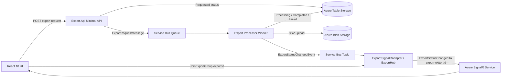
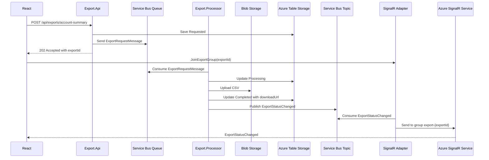

# Async Account Summary Export POC

End-to-end POC for an async export flow with React 18, ASP.NET Core .NET 8 Minimal API, .NET 8 Worker Service, a separate SignalR Adapter, Azure Service Bus, Azure Blob Storage, Azure Table Storage, and Azure SignalR Service.

The important routing choice is that React joins `export-{exportId}` after the API returns `202 Accepted`. The SignalR Adapter sends the final event to that export-specific group. Because this real-world shape has `tenantId` but may not have `userId`, the POC does not broadcast download URLs to `tenant-{tenantId}`.

## Structure

```text
export-signalr-poc/
  backend/
    ExportPoc.sln
    src/
      Export.Api/
      Export.Processor/
      Export.SignalRAdapter/
      Export.Contracts/
  frontend/
    account-export-ui/
  infra/
    azure-create.sh
    azure-create.ps1
    azure-cleanup.sh
    azure-cleanup.ps1
  README.md
```

## Architecture Notes

The API returns `202 Accepted` after validation, durable status creation, and queueing. It does not generate the file.

The Processor owns export work: it consumes the Service Bus request message, updates status storage, generates CSV, uploads to Blob Storage, creates a 30 minute read-only SAS URL, and publishes `ExportStatusChanged`.

The SignalR Adapter exists as a backend bridge. It consumes the Service Bus topic event and pushes it to React through Azure SignalR. It does not generate files or update business status.

The status API is a fallback only. The main UX path is event-driven through SignalR.

## Mermaid Diagrams

### Component Diagram



### Sequence Diagram



### Message Flow Diagram

```mermaid
flowchart TD
  A[Export.Api creates exportId] --> B[Azure Table: Requested]
  B --> C[Service Bus Queue: account-summary-export-requests]
  C --> D[Export.Processor consumes request]
  D --> E[Azure Table: Processing]
  E --> F{accountId == FAIL001?}
  F -->|yes| G[Azure Table: Failed]
  G --> H[Service Bus Topic: ExportStatusChanged Failed]
  F -->|no| I[Blob: tenant/export/account-summary.csv]
  I --> J[Azure Table: Completed with SAS URL]
  J --> K[Service Bus Topic: ExportStatusChanged Completed]
  H --> L[SignalR Adapter subscription: signalr-adapter]
  K --> L
  L --> M[SignalR group: export-{exportId}]
  M --> N[React shows status and download link]
```

## Create Azure Infra

```bash
az login
az account set --subscription "<subscription-id>"
cd infra
./azure-create.sh
```

PowerShell:

```powershell
az login
az account set --subscription "<subscription-id>"
cd infra
.\azure-create.ps1
```

The script creates:

- Resource group: `rg-export-signalr-poc`
- Storage account with blob container `exports` and table `ExportStatuses`
- Service Bus queue `account-summary-export-requests`
- Service Bus topic `export-status-events`
- Service Bus subscription `signalr-adapter`
- Azure SignalR Service in Default mode

It also writes local `appsettings.Development.json` files and `frontend/account-export-ui/.env`.

## Run Locally

Terminal 1:

```bash
cd backend/src/Export.Api
dotnet run
```

Terminal 2:

```bash
cd backend/src/Export.Processor
dotnet run
```

Terminal 3:

```bash
cd backend/src/Export.SignalRAdapter
dotnet run
```

Terminal 4:

```bash
cd frontend/account-export-ui
npm install
npm run dev
```

Open `http://localhost:5173`.

Local ports:

- Export.Api: `http://localhost:5001`
- Export.Processor: worker only
- Export.SignalRAdapter: `http://localhost:5003`
- React: `http://localhost:5173`

## Demo

Successful export:

1. Open React UI at `http://localhost:5173`.
2. Confirm SignalR status is `Connected`.
3. Enter tenantId `TENANT001`.
4. Enter accountId `ACC1001`.
5. Click `Download Account Summary`.
6. UI shows `Requested` after API returns `202 Accepted`.
7. React joins `export-{exportId}`.
8. Processor consumes the queue message, updates `Processing`, uploads CSV, updates `Completed`, and publishes `ExportStatusChanged`.
9. SignalR Adapter consumes the topic event and sends it to group `export-{exportId}`.
10. React receives `ExportStatusChanged`, shows `Completed`, and displays `Download CSV`.

Failure export:

1. Enter accountId `FAIL001`.
2. Click `Download Account Summary`.
3. Processor simulates failure, updates `Failed`, and publishes a failed event.
4. SignalR Adapter pushes the failed event.
5. React shows `Failed` and the error message.

## Key Code Locations

- Service Bus request message is sent in `backend/src/Export.Api/Program.cs`.
- Service Bus request message is consumed in `backend/src/Export.Processor/AccountSummaryExportWorker.cs`.
- Blob upload happens in `UploadCsvAndCreateSasAsync` in `AccountSummaryExportWorker.cs`.
- Table Storage status is updated in `Export.Api/Program.cs` and `AccountSummaryExportWorker.cs`.
- `ExportStatusChanged` is published in `PublishStatusChangedAsync` in `AccountSummaryExportWorker.cs`.
- `ExportStatusChanged` is consumed in `backend/src/Export.SignalRAdapter/ExportStatusEventSubscriber.cs`.
- SignalR Hub lives in `backend/src/Export.SignalRAdapter/ExportHub.cs`.
- React SignalR service lives in `frontend/account-export-ui/src/services/signalService.ts`.
- React API service lives in `frontend/account-export-ui/src/services/exportApi.ts`.

## Cleanup

```bash
cd infra
./azure-cleanup.sh
```

PowerShell:

```powershell
cd infra
.\azure-cleanup.ps1
```
